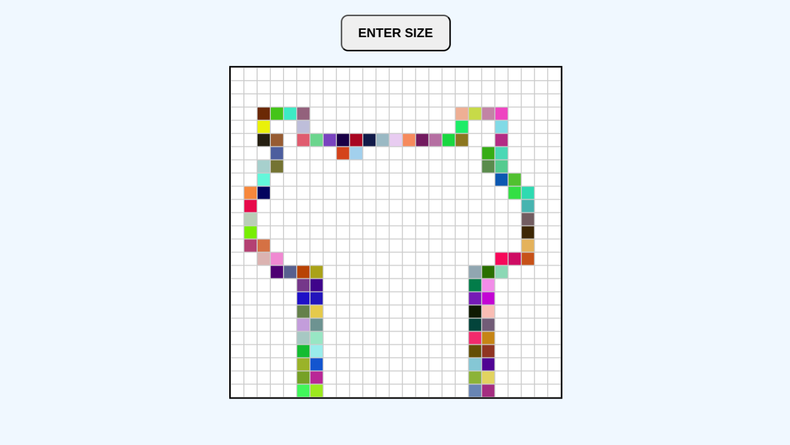

# 🎨 Each-a-Sketch

A simple **Etch-a-Sketch–style drawing page** built with **JavaScript, HTML, and CSS**.  
This project is part of **[The Odin Project](https://www.theodinproject.com/)** curriculum, focusing on practicing **DOM manipulation** and working with **events**.

---

## 📌 Features
- Generate a customizable grid (default: 16×16). 
- Change the grid size dynamically via user input (up to 100×100).  
- Hover over squares to color them with random RGB values.  
- Reset and rebuild the grid easily with a single button click.  

---

## 🖥️ Preview
  
